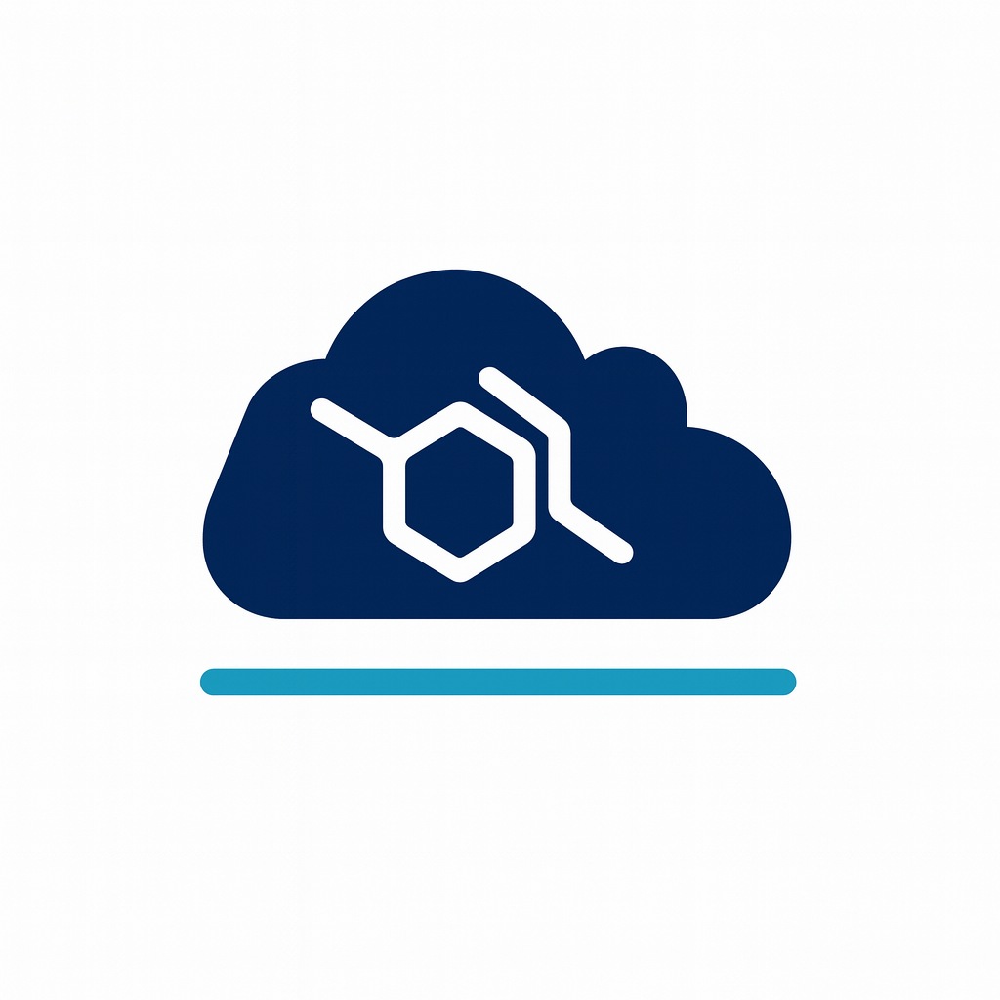

  

# DSDN — Distributed Storage & Data Network

**DSDN** adalah sistem **data dan komputasi terdistribusi semi-desentral** yang
dirancang agar **verifiable-by-design**, bukan berbasis kepercayaan pada satu
entitas.

DSDN menggabungkan:
- data availability log,
- replikasi lintas zona,
- eksekusi komputasi terisolasi,
- serta governance & compliance yang dibatasi secara teknis.

Repositori ini berisi **implementasi inti DSDN** dalam tahap aktif pengembangan.

---

## Status Proyek

⚠️ **Experimental / Work in Progress**  
Belum siap produksi. Arsitektur, API, dan model state **masih dapat berubah**.

---

## Masalah yang Ingin Diselesaikan

Infrastruktur internet modern sangat bergantung pada:
- pusat data terpusat,
- operator yang dipercaya,
- dan kontrol administratif tunggal.

Hal ini menciptakan:
- single point of failure,
- risiko privasi,
- dan konsentrasi kekuasaan.

DSDN bertujuan memindahkan **data dan komputasi** ke jaringan node terdistribusi,
tanpa menciptakan aktor baru yang harus dipercaya.

---

## Prinsip Desain Utama

- **Verifiable-by-design**  
  Tidak ada coordinator, validator, atau foundation yang menjadi sumber
  kebenaran tunggal.

- **Deterministic state reconstruction**  
  State jaringan dibangun ulang secara deterministik dari log Data Availability,
  bukan disimpan sebagai state otoritatif.

- **Minimal trust assumptions**  
  Node, validator, dan coordinator diasumsikan tidak dipercaya secara default.

- **Auditability & transparency**  
  Seluruh keputusan sistem dapat direplay dan diaudit.

---

## Arsitektur Tingkat Tinggi

DSDN terdiri dari tiga plane utama:

### 1. Control Plane (Metadata)
- Metadata dipost sebagai blob ke **Data Availability layer**.
- Setiap node merekonstruksi state lokal melalui replay log deterministik.
- Tidak ada state otoritatif tunggal.

### 2. Data & Compute Plane
- Data disimpan sebagai chunk beralamat hash.
- Replikasi target: **3 replika di zona berbeda**.
- Eksekusi program dijalankan dalam sandbox:
  - WASM/WASI
  - microVM (mis. Firecracker)

### 3. Governance & Compliance Plane
- Dijalankan oleh validator dengan identitas terverifikasi.
- Validator **tidak memiliki akses ke data terenkripsi**.
- Tindakan terbatas pada penghapusan pointer/endpoint publik, bukan data fisik.

---

## Model Kepercayaan (Trust Model)

- **Node**: tidak dipercaya → diverifikasi melalui replikasi & kuorum  
- **Coordinator**: stateless → keputusannya dapat direkonstruksi  
- **Validator**: tidak dipercaya untuk privasi → tidak memegang kunci dekripsi  
- **Foundation**: kewenangan dibatasi dan dicatat secara on-chain  

Kegagalan satu komponen tidak dapat mengubah kebenaran state jaringan.

*jika anda ingin langkah langkah menjadi node operator*
silahkan buka [DSDN_NODE_OPERATOR_GUIDE](assets/docs/DSDN_NODE_OPERATOR_GUIDE.md)

---

## Whitepaper

Desain lengkap dan rasional teknis tersedia di whitepaper DSDN  
(lihat folder `docs/`).

---

## Lisensi

MIT License.
